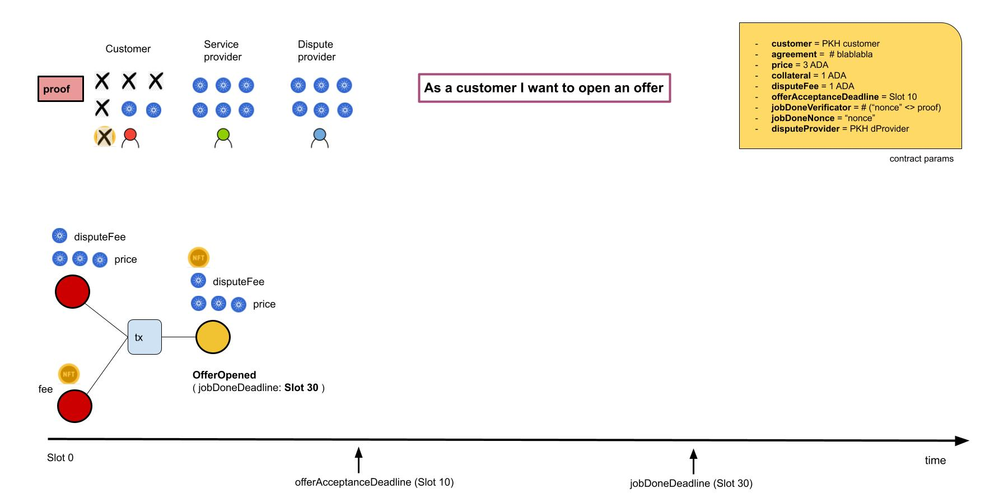
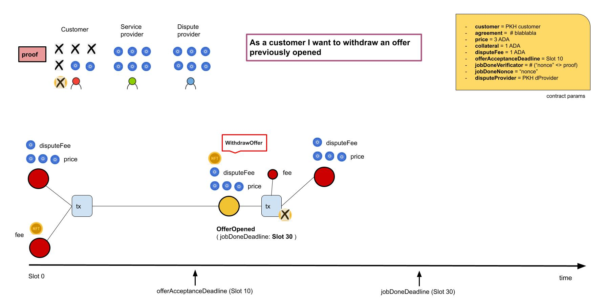
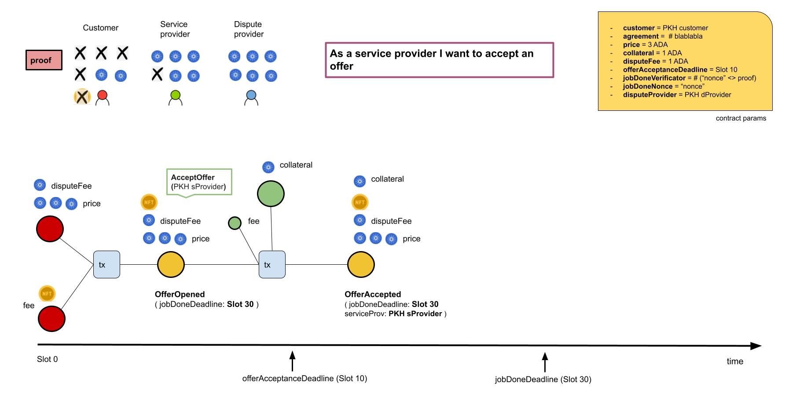
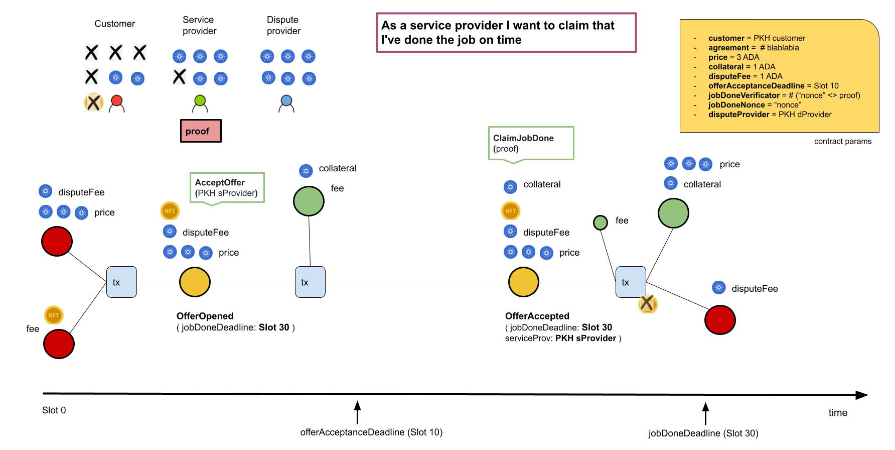
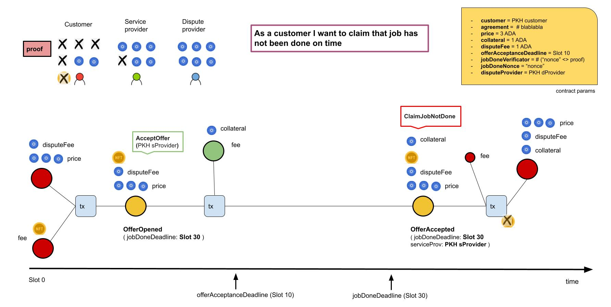
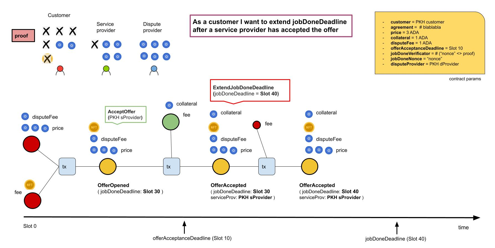
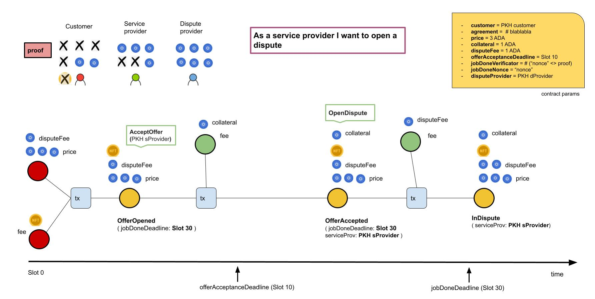
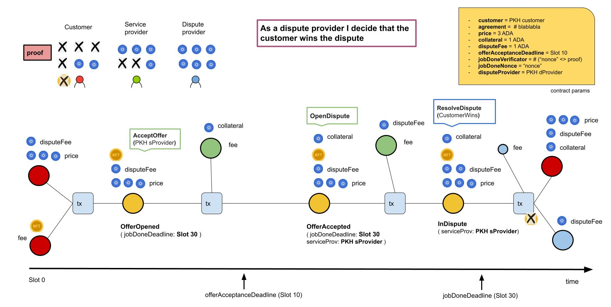
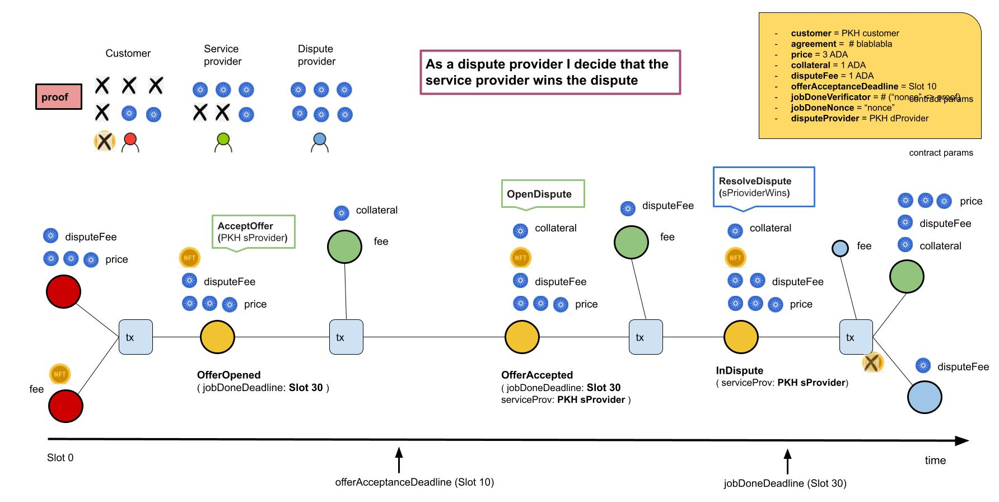

# plutus-service-agreement

## Subject

This is a toy project with the aim of modelling a service agreement between 2 untrusted parties (customer and service provider) leveraging the Cardano blockchain. The 2 parties would use the blockchain technology provided by Cardano to transact value and set the contract terms (price, collateral, deadlines, etc). Apart from the 2 mentioned parties, we need a third party, the dispute provider who will make a decision on the resolution of the project in case of a dispute. 

This is the final project for the "Cardano developer professional" program by Emurgo Academy. 


## Functional design 

The party kicking off the contract is the customer. Concretely, **the customer opens an offer** setting the contract terms. 

- **Customer public address**. (PKH)
- **Text agreement**. A description of the service that needs to be provided. (Hash value)
- **Price**. The value paid to the service provider willing to provide the service in the terms described in the offer/contract. At the time of kicking off the contract the customer have to lock this value in the contract.  
- An **offer acceptance deadline**. This attribute defines a deadline for the case where no service provider accepts the offer. (the customer needs to get the money back)
- **Service provider collateral**. It defines a collateral value which has to be lock in the contract by the service provider accepting the offer. In the case that the service provider doesn't provide the service in the terms agreed, the customer will get that value as a compensation. 
- **Dispute Fee**. It defines the value paid to the dispute provider in case of a dispute between the customer and the service provider. The customer has to lock this value in the contract at the time of opening the offer. In the case of a dispute and the customer wins it, they will get this value back. On the other hand the customer will lose this value. Note here that the party who will open a dispute will be the service provider, locking the dispute fee in the contract at that moment. 
- **Dispute provider public address** (PKH). The customer will set this attribute when the offer is opened. This party will decide who wins in the case of a dispute. At the time of dispute resolution the dispute provider will be able to unlock the dispute fee value (just one of the 2 dispute values locked in the contract; the other will go to the winning party)
- A couple of attributes (**JobDoneVerificator** + **JobDoneNonce**) set by the customer when opening the offer. The goal of these 2 values is to verify that the service provider is claiming that job is done with the authorization of the customer. The logic is as a follows: the customer choices a secret value 'proof' which will be given to the service provider once the job is done. With that secret value the customer computes JobDoneVerificator (off-chain) following the formula bellow. The customer will set JobDoneVerificator and JobDoneNonce as initial parameters of the contract. Once the service provider does the job, the customer will reveal the secret 'proof' to the service provider off-chain, and then the latter will be able to get the price value showing the proof to the contract.

```
    JobDoneVerificator = hash ( proof <> JobDoneNonce )
```

- A **job done deadline**. It defines the maximum date to deliver the service/job. In the case that the service provider doesn't proof the job has been done or opens a dispute before that deadline, the customer will be able to get their money back (price + dispute fee) along with the collateral locked by the service provider.  


Please, check out the use cases diagrams section for details on the different workflows. 


## Technical design

This project consists of 4 parts: 

- **Types**. Common types for on-chain, off-chain and tests.
- **OnChain**. It implements the on-chain part (the plutus script) which has been built using `Plutus.Contract.StateMachine` module.
- **OffChain**. It implements the contracts (`Contract` Monad) for the customer, the service provider and the dispute provider. 
- **Specs**. It defines a bunch of scenarios (`EmulatorTrace`) with different use cases which can be run in the repl. Additionally, it defines unit tests for these scenarios.


**Note about Plutus StateMachine module**.
At the time of publishing this project the `Plutus.Contract.StateMachine` library can not be used in testnet/mainnet due to the high sizes of the transactions generated.


## Use cases diagrams

These diagrams represent some of the use cases considered in the contract. For the rest, please check module `Spec.ServiceAgreement`.

<br />

###"As a customer I want to open an offer"



<br />

###"As a customer I want to withdraw an offer previously opened"



<br />

###"As a service provider I want to accept an offer"



<br />

###"As a service provider I want to claim that I've done the job on time"



<br />

###"As a customer I want to claim that job has not been done on time"



<br />

###"As a customer I want to extend jobDoneDeadline after a service provider has accepted the offer"



<br />

###"As a service provider I want to open a dispute"



<br />

###"As a dispute provider I decide that the customer wins the dispute"



<br />

###"As a dispute provider I decide that the service provider wins the dispute"



<br />

## How to run 

Before being able to run the project, we need to clone plutus-apps repository, checkout tag  and run nix-shell from plutus-apps folder.

```bash
# clone plutus-apps
git clone https://github.com/input-output-hk/plutus-apps.git
cd plutus-apps
git checkout tags/v0.1.0
nix-shell --extra-experimental-features flakes

nix-shell> cabal update
nix-shell> cabal build
```

<br />


```bash
# clone plutus-service-agreement
git clone https://github.com/kindofdev/plutus-service-agreement.git
cd path/to/plutus-apps
nix-shell --extra-experimental-features flakes

nix-shell> cd path/to/plutus-service-agreement
nix-shell> cabal update 
nix-shell> cabal build 
# run test suite
nix-shell> cabal test

# run an scenario in the repl
nix-shell> cabal repl test-suiteXXXX todo
nix-shell-repl> import xxx
nix-shell-repl> runEMulXXX 


```
<br />

## License

[MIT](https://choosealicense.com/licenses/mit/)

Made with <span style="color: #e25555;">&#9829;</span> in Málaga by José Velasco